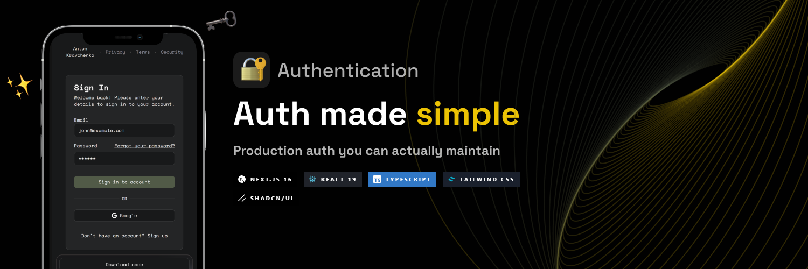
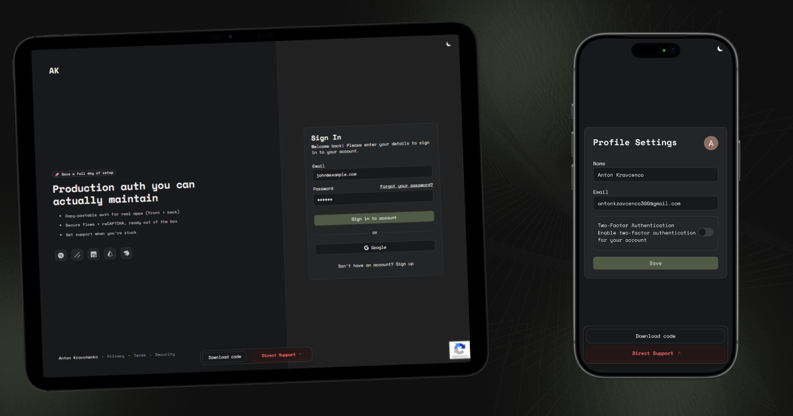

## 📌 Why I Built This

I built this project to avoid rewriting authentication from scratch in every new project.  
The goal was to provide a ready-to-use authentication system for Nest.js and Next.js that developers could quickly integrate and configure with Prisma.

## ❌ Why It Didn't Work

Authentication solutions are already widely available and well-established.  
Different tech stacks and existing templates made it difficult for developers to justify using this specific implementation.

---

### 📷 More Screenshots

